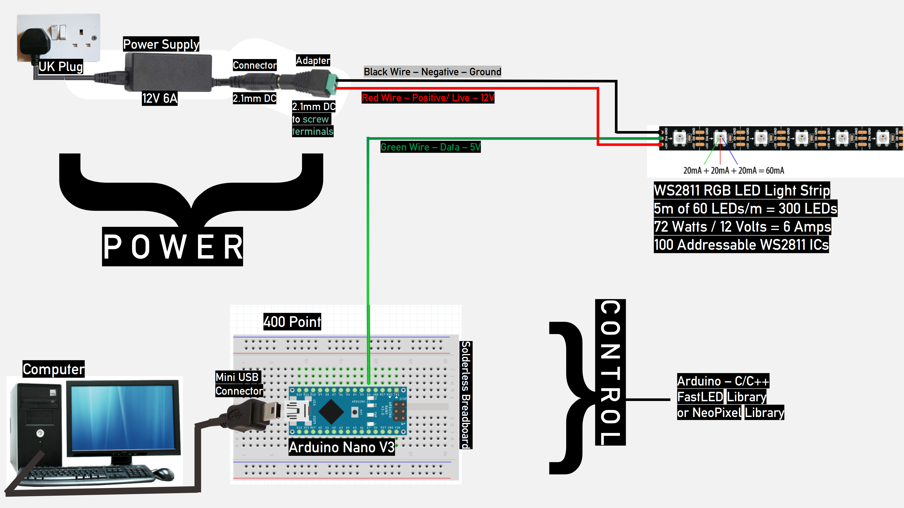

# LED Light Strip

Nice lighting for my room.

Hooked it up to an Arduino and made some sketches for animations.

Added some extra wiring for audio input, and wrote another sketch for a music visualiser (voltage/amplitude based only).

A (very rough) schematic if you'd like to make one yourself:

Music Visualiser (variant 1):

